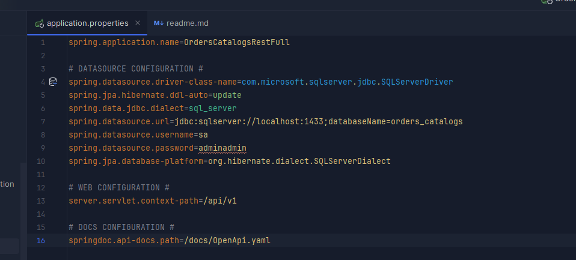

### Orders and catalogs API rest full using Spring Boot and Spring Data JPA

This project is a simple api rest full using Spring Framework to solve a simple program using
a simple and clean layer architecture.

### Technologies
 - Spring Framework
 - Microsoft SQL Server

### Requirements
 - Java 17 Amazon Corretto distribution
 - Microsoft SQL Server any instance or docker container
 - Maven 3.8.4

### Getting Started
First you need install Java 17 Amazon Corretto distribution or any version of Java 17 instead.
Then you need instantiate a Microsoft SQL Server you can run a docker container with the following command:
```shell
# Pull the docker image
docker pull mcr.microsoft.com/mssql/server

# Run the docker container
docker run -e "ACCEPT_EULA=Y" -e "MSSQL_SA_PASSWORD=adminadmin" -p 1433:1433  --name <name> -d mcr.microsoft.com/mssql/server:2022-preview-ubuntu-22.04
```
You can connect to the instance using any database client like:
> - Azure Data Studio
> - DataGrip by JetBrains
> - SQL Server Management Studio

or any other database client that you prefer and that supports Microsoft SQL Server.

After that you need to create a database with the following SQL command:
```sql
CREATE DATABASE orders_catalogs
```

then clone the repository and open it on the IDE that you prefer, in order to run the project you need configure the datasource
you can find the project properties file in the following path: `src/main/resources/application.properties` 


on this file you can change the project configurations to connect to the database instance that you have created before.
Note that if you are following this readme you don't need to change anything in this file because the commands above will create a database with the same name and password that is in the file.

so take it easy :)

#### For VSCode
```shell
#Open a terminal and run the following command if you already have JAVA 17 and Maven you can use
mvn clean install
mvn spring-boot:run
```
obviously this is for the shell CLI, but you can use the Spring Boot extension for VSCode or install Intellij IDEA instead

#### For intellij IDEA
only clone the repo and open it with the IDE and run the project :) as you can see this is the best way to run the project

### API Docs
You can find the API docs in the following path: `https://documenter.getpostman.com/view/21602342/2sAXjRWUvZ`